# ADReportingTools


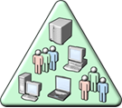

This module contains a collection of PowerShell tools that you can use to generate reports and gather information about your Active Directory domain. Many of these commands will require the ActiveDirectory module, which you can get by installing the Remote Server Administration Tools (RSAT) for Active Directory on Windows 10.

```powershell
Get-WindowsCapability -Online -Name RSAT.Active* | Add-WindowsCapability -online
```

The assumption is that you will run these commands with administrator credentials from a Windows 10 desktop. You should not need console access to a domain controller. These commands are for working with a local Active Directory infrastructure, not anything in Azure.

## Installation

A _**pre-release**_ version of this module is available in the PowerShell Gallery. Install it using `Install-Module` after you have installed the Active Directory RSAT capability.

```powershell
Install-Module -name ADReportingTools -AllowPrerelease
```

## Design Philosophy

The Active Directory module from Microsoft is not especially difficult to use. It is quite easy to get information from Active Directory.

```powershell
Get-ADuser -filter "department -eq 'sales'" -properties Title,Department
```

However, you need to be very explicit about what information you want to see. You might need to create complicated filters. You need to know the Active Directory property names. Finally, you need to format the results into something meaningful. It might be better to think of the ActiveDirectory module as a _framework_.

The ADReportingTools module is based on this framework. The goal is to create a set of commands and tools to make it very easy to get information out of Active Directory in meaningful and useful ways. Many of the commands in this module are wrappers for underlying ActiveDirectory module commands, written to be easy to use.

The ADReportingTools focuses primarily on working with Active Directory users, groups, and computers. The module includes commands intended to be true reporting commands. As the module name suggests, module commands are intended to _get_ information from Active Directory. This module is not designed to manage Active Directory.

:warning:
**These commands have not been tested in a large domain environment, or one with cross-domain trusts and/or nested groups that cross domains. If you have used the ActiveDirectory modules in the past and had poor performance due to these types of circumstances, the modules in this command most likely won't perform any better.**

## Module Commands

### [Get-ADReportingTools](docs/Get-ADReportingTools.md)

`Get-ADReportingTools` is a meta-command. Run this command to get a formatted list of available commands in the ADReportingTools module.

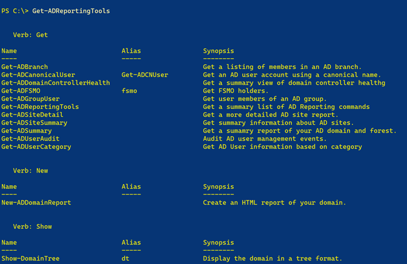

### Users

#### [Get-ADCanonicalUser](docs/Get-ADCanonicalUser.md)

Often you will find user names in the form domain\username. This command makes it easier to find the Active Directory user account using this value. If the Active Directory Recycle Bin feature is enabled, you can use the `IncludeDeletedObjects` parameter to search for the user account if it can't be found with the initial search.


#### [Get-ADUserAudit](docs/Get-ADUserAudit.md)

This command will search the Security event logs on your domain controllers for specific user-related events. These activities are not replicated, so you have to search each domain controller. Be aware that you may see related events for some actions. For example, if you create and enable a new user, you'll see multiple entries for the same event.

The output will show you the user accounts that match the search criteria, and the domain account that was responsible. Although, this command can't tell you which administrator is responsible for which activity. The best you can learn is that for a given time frame, these user accounts were managed. Or these administrators did something. You would need to search the event log on the domain controller for more information.


#### [Get-ADUserCategory](docs/Get-ADUserCategory.md)

`Get-ADUserCategory` is based on the concept of getting user information from a pre-defined category. For example, you might want to get the properties DisplayName, Name, Title, Department, and Manager for a Department category. The ADReportingTools module will define a set of pre-defined categories that you can reference through `$ADUserReportingConfiguration`.

```dos
PS C:\> $ADUserReportingConfiguration

Name         Properties
----         ----------
Department   {DisplayName, Name, Title, Department...}
Basic        {DisplayName, Name, SamAccountname, UserPrincipalName...}
Address      {DisplayName, Name, TelephoneNumber, Office...}
Organization {DisplayName, Name, Title, Department...}
Pwinfo       {DisplayName, Name, PasswordExpired, PasswordLastSet...}
```

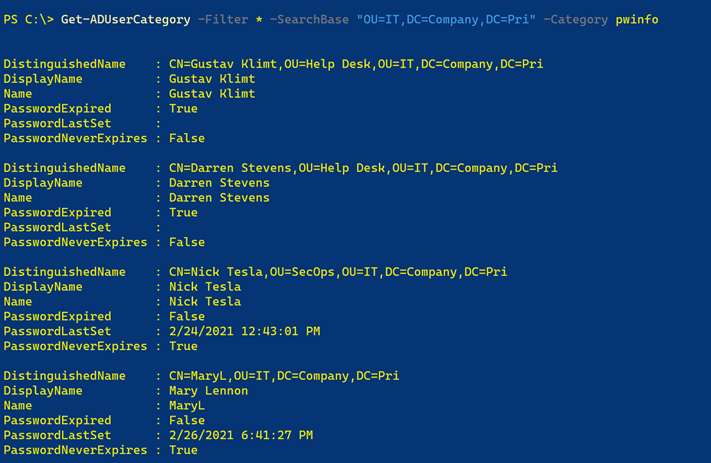

The module ships with a JSON file that defines the categories. You can easily modify this variable to define a new category.

```powershell
$ADUserReportingConfiguration += [pscustomobject]@{Name="Custom";Properties="DisplayName","Description"}
```

Or add a property to an existing category.

```dos
PS C:\> $ADUserReportingConfiguration.where({$_.name -eq 'basic'}).foreach({$_.properties+="SID"})
PS C:\> Get-ADUserCategory gladysk -Category Basic


DistinguishedName : CN=GladysK,OU=IT,DC=Company,DC=Pri
DisplayName       : Gladys Kravitz
Name              : GladysK
SamAccountname    : GladysK
UserPrincipalName : gladysk@Company.Pri
Enabled           : True
WhenCreated       : 1/25/2021 1:32:35 PM
WhenChanged       : 3/8/2021 6:52:01 PM
SID               : S-1-5-21-493037332-564925384-1585924867-1105
```

The user's distinguished name is always included in the output.

#### [Split-DistinguishedName](docs?Split-DistinguishedName.md)

This command will take an Active Directory distinguishedname and break it down into its component elements. The command does not test or verify any of the elements. It is merely parsing a text string.

```dos
PS C:\> Split-DistinguishedName "CN=Foo,OU=Bar,OU=Oz,DC=Research,DC=Globomantics,DC=com"


Name      : Foo
Branch    : Bar
BranchDN  : OU=Bar,OU=Oz,DC=Research,DC=Globomantics,DC=com
Domain    : Research
DomainDN  : DC=Research,DC=Globomantics,DC=com
DomainDNS : Research.Globomantics.com
```

### Groups

#### [Get-ADGroupUser](docs/Get-ADGroupUser.md)

`Get-ADGroupUser` command will display all users of a given Active Directory group. The search is automatically recursive. The default output is a formatted table that will highlight disabled accounts in red. The ANSI color coding will only work in a console session.

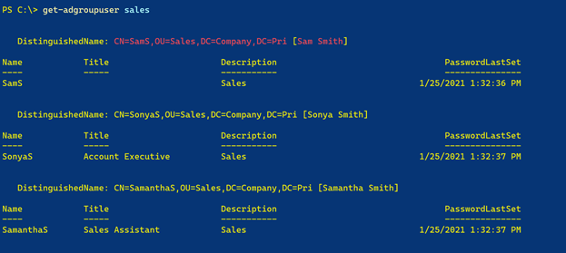

Or you can use the default list view.

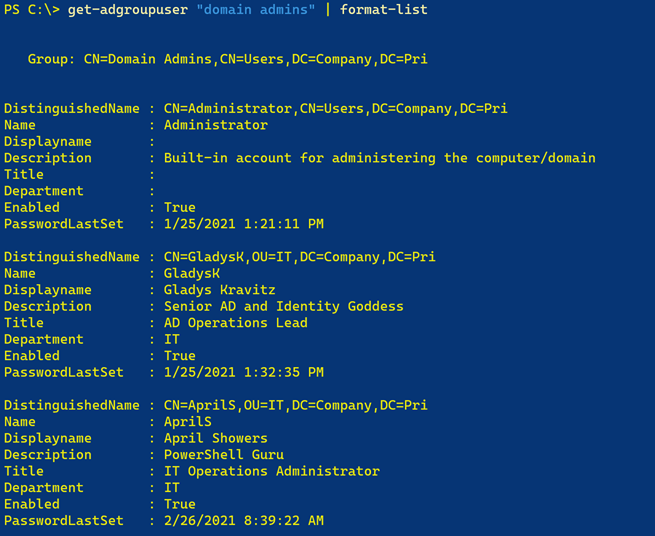

#### [GetADGroupReport](docs/Get-ADGroupReport.md)

Get-ADGroupReport will create a custom report for a group showing members. Get-ADGroupUser is intended to display group membership details Get-ADGroupReport focuses on the group, although members are also displayed. Members are always gathered recursively. You can filter for specific types of groups. You can also opt to exclude groups under CN=Users and CN=BuiltIn. The groups "Domain Users", "Domain Computers", and "Domain Guests" are always excluded from this command.


If your PowerShell hosts supports it, ANSI color schemes will be used to highlight things such as Distribution groups and disabled user accounts.

You can also use a custom table view.


Distribution groups will be shown in green and member counts of 0 in red. The Age reflects how long since the group has been modified.

### Computers

#### [Get-ADDomainControllerHealth](docs/Get-ADDomainControllerHealth.md)

`Get-ADDomainControllerHealth` is intended to give you a quick summary of the overall health of your Active Directory domain controllers. The concept of "health" is based on the following:

- How much free space remains on drive C:\?
- How much free physical memory?
- What percentage of the Security event log is in use?
- Are any critical services not running? The services checked are ntds,kdc,adws,dfs,dfsr,netlogon,samss, and w32time. Not every organization runs DNS and/or DHCP on their domain controllers so those services have been omitted.

Output will be color-coded using ANSI escape sequences, if the PowerShell session supports it.

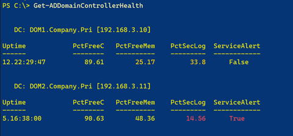

The domain controller services are a nested object, but if you expand them, they have a defined and formatted view.

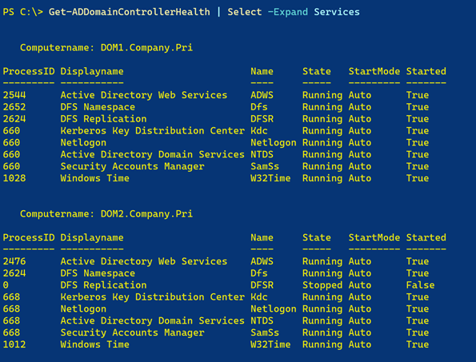

You can use additional custom views to format the results.


### Reports

The primary goal for this module is reporting. The intention is to provide easy to use commands that will provide at least a snapshot view of information you might want to know.

#### [Get-ADSummary](docs/Get-ADSummary.md)

This simple command will give you a snapshot-sized summary of your Active Directory domain and forest.


#### [Get-ADBranch](docs/Get-ADBranch.md)

`Get-ADBranch` will get all users, groups, and computers from a given Active Directory organizational unit or container and display a hierarchical report. The search is recursive from the starting search base. The output is grouped by organizational unit or container. Within each level, Active Directory objects are grouped by type, e.g. User.

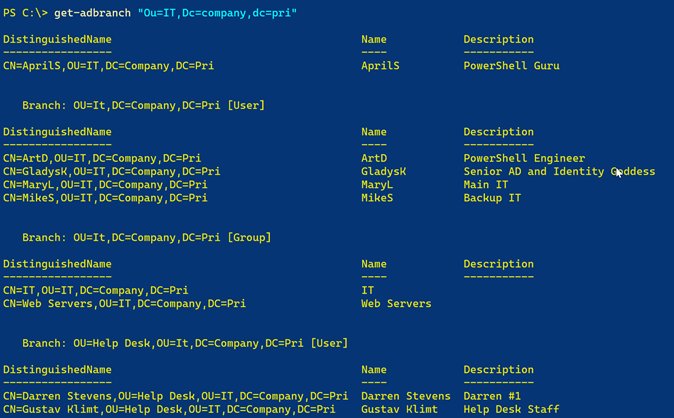

**Note**: There is a formatting bug that prevents the first item from being properly grouped.

#### [Get-ADFSMO](docs/Get-ADFSMO.md)

`Get-ADFSMO` will display all FSMO role holders for the forest and domain at a glance.


#### [Get-ADSiteSummary](docs/Get-ADSiteSummary.md)

`Get-ADSiteSummary` presents a quick view of your sites and subnets.

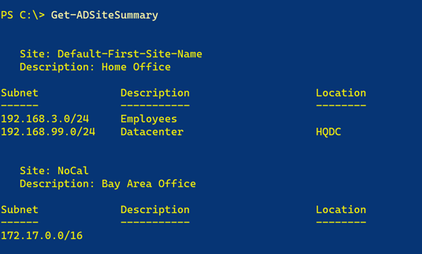

#### [Get-ADSiteDetail](docs/Get-ADSiteDetail.md)

`Get-ADSiteDetail` will present a summary report of your Active Directory sites with a bit more detail. This command will show the site description, associated subnets, and when the site object was created and last modified. Information is displayed in a formatted table.


#### [Show-DomainTree](docs/Show-DomainTree.md)

  Show-DomainTree will display your domain in a tree view at the console. By default, the function will use color-coded ANSI formatting, assuming your PowerShell console supports it. The default display uses the organizational unit names. Although, you can use the distinguishedname of each branch. If you use -Containers, containers like Users will be included.

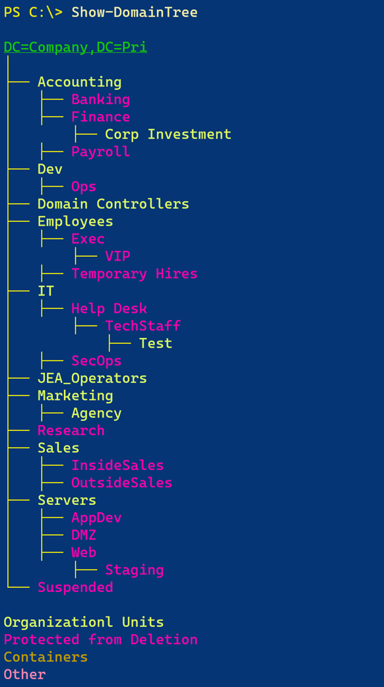

#### [New-ADDomainReport](docs/New-ADDomainReport.md)

`New-ADDomainReport` will create an HTML report of your domain. The report layout is by container and organizational unit. Underneath each branch will be a table display of users, computers, and groups. Beneath each group will be table of recursive group members. You should get detail about users and computers if you hover the mouse over the distinguished name. The report includes javascript to enable collapsible regions.

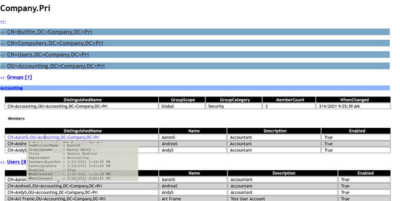

The ADReportingTools module includes a CSS file which will be used by default. But you can specify an alternate CSS file. If you want to make the file portable, you can opt to embed the CSS into the HTML file. You can only embed from a file, not a URL reference.

The module's CSS file can be found in the [reports](reports/domainreport.css) folder. You can view a complete sample report [here](reports/sampledomain.html).

#### [New-ADChangeReport](docs/New-ADChangeReport.md)

`New-ADChangeReport` will create an HTML report showing changes to Active Directory users, computers, and groups since a given date and time. The command uses `Get-ADObject` to query the `WhenChanged` property. The objects are organized by class and/or container and written to an HTML file. The command uses a CSS file from the ADReportingTools module, although you can specify your own. To make the HTML file portable, you can opt to embed the CSS content from a file source.

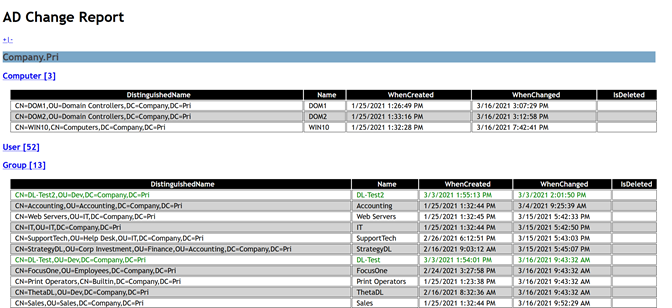

You can view the default CSS file [here](reports/changereport.css). A complete sample report can be found [here](reports/samplechange.html).

## Format and Type Extensions

The module includes format and type extensions to simplify using the commands in the Active Directory module. The extensions are automatically imported into your PowerShell session when you import the ADReportingTools module.

Currently, only AD User objects have been extended.

|Name | Type |  Value |
|----  | ---- | ----- |
|LastName |  AliasProperty | Surname|
|DN     |  AliasProperty | DistinguishedName|
|FirstName | AliasProperty | GivenName |
|UPN       | AliasProperty | UserPrincipalName|

These extensions have been grouped as a property set called *Names*.

```dos
PS C:\>Get-ADUser artd | Select-Object Names

DN             : CN=ArtD,OU=IT,DC=Company,DC=Pri
Name           : ArtD
FirstName      : Art
LastName       : Deco
SamAccountName : ArtD
UPN            : artd@company.com
```

Or use a defined view for Active Directory user objects.

```powershell
Get-ADUser -SearchBase "ou=employees,dc=company,dc=pri" -filter * |
Format-Table -view names
```

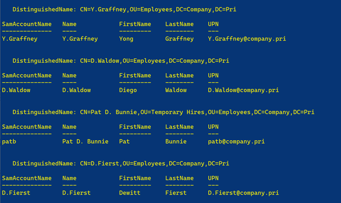

The module adds a default table view for AD group objects.


If your PowerShell console supports it, Distribution, Universal, and DomainLocal groups will be higbhlighted in color.

### ADReportingToolsOptions

The ANSI sequences used in the format files are user-configurable. Values are stored in an exported variable called `ADReportingToolsOptions`, although you shouldn't try to access the variable directly. Use `Get-ADReportingToolsOptions` to see the current values.

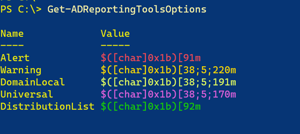

The module uses the `[char]0x1b` escape sequence because it works in both Windows PowerShell and PowerShell 7.x.

If you prefer to customize the sequence, use `Set-ADReportingToolsOptions`.

```powershell
Set-ADReportingToolsOptions DistributionList -ANSI "$([char]0x1b)[38;5;50m"
```

This change is only for the duration of your PowerShell session. Add the command to a PowerShell profile script to make it more permanent.

:octocat: If you would like to see what ANSI sequences look like, install the [PSScriptTools](https://github.com/jdhitsolutions/PSScriptTools/blob/master/README.md) module from the PowerShell Gallery and use [Show-ANSISequence](https://github.com/jdhitsolutions/PSScriptTools/blob/master/docs/Show-ANSISequence.md).

## Future Work

These are items I'm considering adding to the module:

- Get-ADPasswordPending (look at Get-ADUserResultantPasswordPolicy)
- Store `ADReportingToolsOptions` in a JSON file.

### Magical Thinking

These are items that I'm dreaming about:

- a toolset to build HTML reports on the fly
- a WPF based OU browser or a simplified version of ADUC

I welcome suggestions, feedback, and comments in the module repository's [Discussion](https://github.com/jdhitsolutions/ADReportingTools/discussions) section.

last updated 2021-03-17 19:24:57Z
